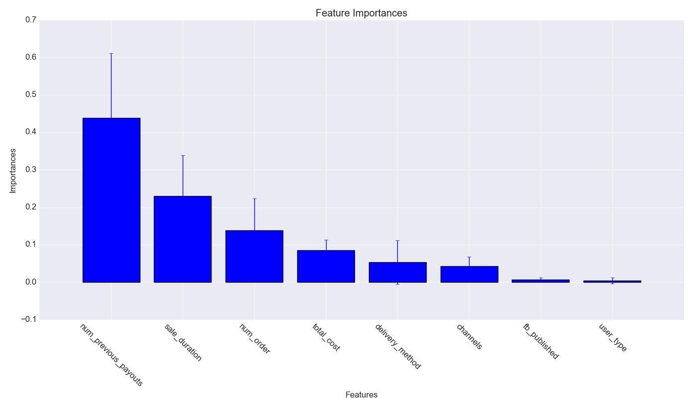
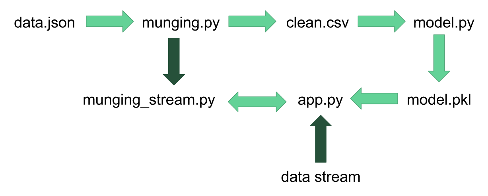

# Fraudulent Event Detection
Predicted fraudulent events for Eventbrite using event data with an accuracy of 98.8% and a recall of 91.1%. Created a web app that classifies fraudulent events on streaming data.

#### Data Preprocessing
Original Data: 44 features, Cleaned Data: 8 features

- Dropped collinear features
- Dropped features with weak correlation
- Dummied categorical features
- Aggregated costs in ticket_types for total_cost
- Extracted # previous payments from previous payouts feature (most frauds had 0 previous payments while others had 10+)
- Imputed null values with mean (selected features had low # of null values)
- Implemented this in `munging.py` to create `clean.csv`

#### Selected & Engineered Features
`delivery_method,
sale_duration,
num_order,
num previous_payouts,
user_type,
fb_published,
channels,
total_cost`

#### Random Forest Classifier
Accuracy: 0.9880, Recall: 0.9112

|                | Predicted Not Fraud | Predicted Fraud |
|----------------|---------------------|-----------------|
| True Not Fraud | 3265                | 16              |
| True Fraud     | 27                  | 277             |

#### Gradient Boosting Classifier
Accuracy: 0.9704, Recall: 0.8500

|                | Predicted Not Fraud | Predicted Fraud |
|----------------|---------------------|-----------------|
| True Not Fraud | 3207                | 58              |
| True Fraud     | 48                  | 272             |

#### Feature Importances

#### Development Process
Cleaned data with `munging.py` and saved it as a csv file. Created classifier in `model.py` and pickled it for the web app. Modified `munging.py` to work with one row of data at a time (for streaming data) and saved it as `munging_stream.py`. Created a web app with Flask in `app.py`.

